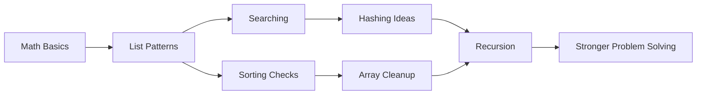

# DSA Code Lab

<p align="center">
  
</p>

<p align="center">
  
  
  
</p>

Welcome to a notebook-first playground for learning data structures and algorithms in Python. This repo is built like a study trail: short problems, direct implementations, and space to keep improving each idea as the journey grows.

## Quick Console

| Open | What is inside | Status |
| --- | --- | --- |
| [`01_Mathematics_List.ipynb`](01_Mathematics_List.ipynb) | Mathematics basics, number theory, list problems, searching patterns, duplicate handling, rotations, and list comprehension | Active |
| [`02_Recursion.ipynb`](02_Recursion.ipynb) | Recursion chapter starter | Warming up |
| [`test.py`](test.py) | Scratch note for left-rotating a list | Scratch |
| [`tempCodeRunnerFile.py`](tempCodeRunnerFile.py) | Temporary runner snippet | Scratch |

## Interactive Map

<details open>
<summary><b>Stage 01: Mathematics and Lists</b></summary>

Current notebook topics include:

- Two sum with hashing
- Duplicate detection in lists
- Sum of first `n` natural numbers
- Digit counting
- Palindrome numbers
- Factorial
- GCD and LCM
- Prime checks
- Divisors
- Sieve of Eratosthenes
- Computing powers
- Average of a list
- Separating even and odd values
- Smaller-than queries
- Largest and second-largest elements
- Sorted-list checks
- String reversal
- Removing duplicates from a sorted array
- Left rotation ideas

</details>

<details>
<summary><b>Stage 02: Recursion</b></summary>

This chapter has been created and is ready for problems such as:

- Base cases and recursive calls
- Factorial by recursion
- Fibonacci
- Sum of digits
- Palindrome recursion
- Recursive array traversal
- Backtracking foundations

</details>

<details>
<summary><b>How to run the notebooks</b></summary>

```bash
jupyter notebook
```

Then open the notebook you want to practice.

If you prefer VS Code, install the Python and Jupyter extensions, then open any `.ipynb` file directly.

</details>

## Learning Flow



## Practice Checklist

- [x] Start mathematics fundamentals
- [x] Add list practice problems
- [x] Explore hashing with two sum
- [x] Add number theory basics
- [ ] Expand recursion notebook
- [ ] Add time and space complexity notes
- [ ] Add solved problem explanations
- [ ] Add test cases for reusable functions

## Repo Style

This repo favors small, readable experiments over heavy structure. Each notebook cell is a checkpoint: try the idea, inspect the output, then refine the solution.

Suggested pattern for future entries:

```text
Problem -> Brute force idea -> Optimized idea -> Complexity -> Test cases
```

## Next Up

The most useful next upgrade is to turn common snippets into clean Python functions and add a short complexity note beside each one. That will make the repo useful both for revision and interview prep.
